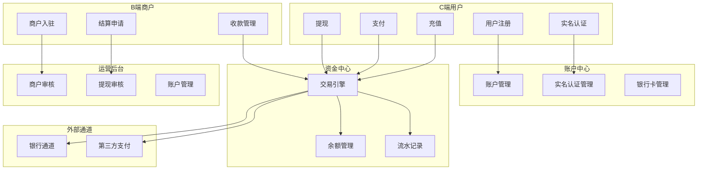
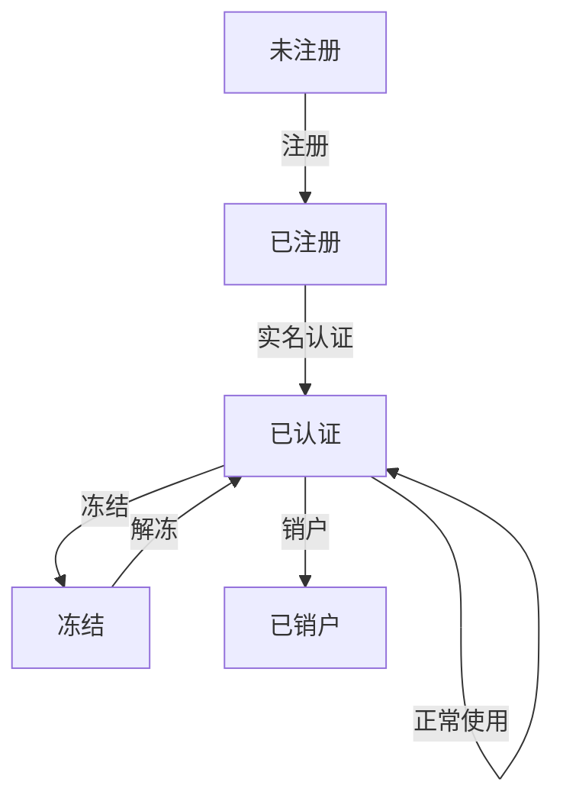
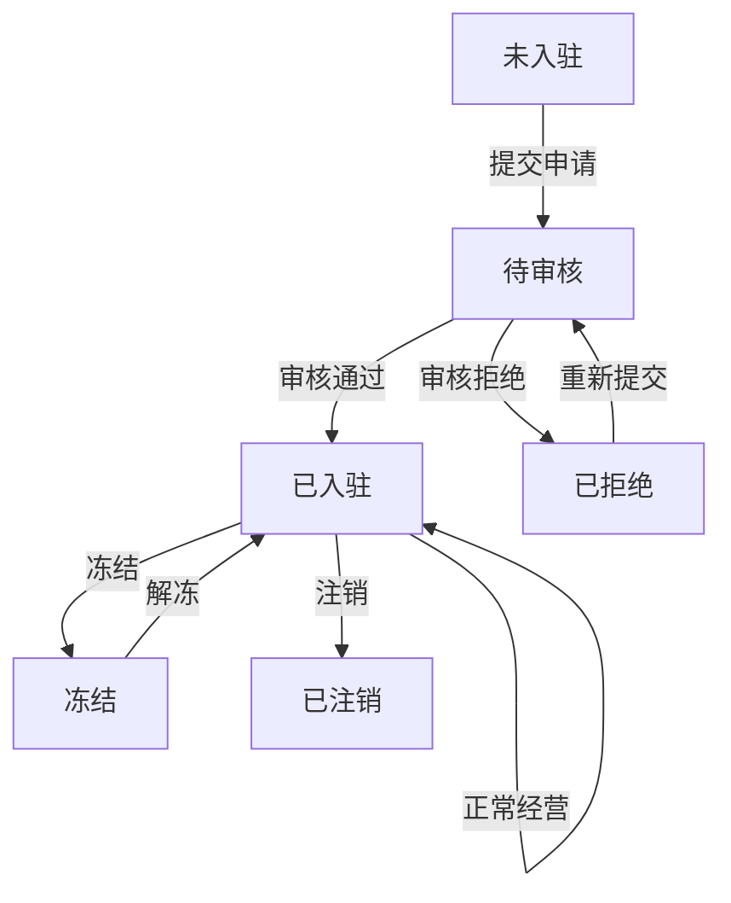

# 支付账户系统 PRD 文档

---

## 一、版本管理

| 版本号 | 修订日期 | 修订人 | 修改内容 |
| :--- | :--- | :--- | :--- |
| V1.0 | 2026-05-22 | 系统分析师 | 初始版本，完成 MVP 需求定义 |
| V1.1 | 待确定 | 待确定 | 补充完整版本需求 |

---

## 二、业务背景

### 2.1 业务场景描述

本系统是一个**第三方支付账户系统**，面向个人用户（C端）、商户（B端）和平台运营人员，提供完整的支付账户管理能力。

**核心业务模式**：
- **To C**：个人用户通过账户进行充值、消费支付、提现等操作
- **To B**：商户入驻平台，通过平台接收用户付款并进行资金结算
- **平台运营**：管理商户入驻审核、提现审核、账户管理、数据监控

### 2.2 问题分析

| 痛点 | 影响 | 解决方案 |
| :--- | :--- | :--- |
| 用户支付体验差 | 用户流失 | 提供便捷的充值、支付、提现流程 |
| 商户入驻流程繁琐 | 商户转化率低 | 分步骤引导入驻，减少信息填写压力 |
| 资金流转不透明 | 用户信任度低 | 实时显示余额、交易记录、结算进度 |
| 人工审核效率低 | 运营成本高 | 提供审核工作台，支持批量处理 |

### 2.3 目标和价值

| 目标类型 | 目标描述 | 价值 |
| :--- | :--- | :--- |
| **用户体验** | 提供便捷、安全的支付体验 | 提升用户满意度和留存率 |
| **商户服务** | 提供高效的入驻和结算服务 | 吸引优质商户入驻 |
| **运营效率** | 提供自动化、可视化的运营工具 | 降低运营成本，提高效率 |
| **合规要求** | 满足金融监管要求 | 确保业务合规运营 |

---

## 三、需求描述

### 3.1 角色定义

| 角色 | 描述 | 核心需求 |
| :--- | :--- | :--- |
| **C端用户** | 个人消费者 | 账户管理、充值、支付、提现、交易查询 |
| **B端商户** | 企业/个体商户 | 入驻申请、收款管理、资金结算 |
| **运营人员** | 平台运营管理者 | 审核管理、账户管理、数据监控 |

---

### 3.2 C端用户系统需求

#### 3.2.1 用户首页

**页面布局示意图：**

```
┌─────────────────────────────────────────┐
│          头部导航（用户信息/消息/设置）   │
├─────────────────────────────────────────┤
│          余额卡片（可用余额/冻结金额）    │
├─────────────────────────────────────────┤
│          快捷操作（充值/付款/收款/提现）  │
├─────────────────────────────────────────┤
│          最近交易记录                    │
├─────────────────────────────────────────┤
│          功能入口（银行卡/安全中心/帮助） │
├─────────────────────────────────────────┤
│          底部导航（首页/记录/收款/我的）  │
└─────────────────────────────────────────┘
```

**余额卡片：**

| 字段名 | 展示方式 | 取值来源 | 说明 |
| :--- | :--- | :--- | :--- |
| 账户余额 | 货币格式（大号字体） | account_balance.total_amount | 总资产金额 |
| 可用余额 | 数字格式 | account_balance.available_amount | 可自由支配金额 |
| 冻结金额 | 数字格式 | account_balance.frozen_amount | 被冻结的金额 |

**快捷操作：**

| 按钮名称 | 功能说明 | 触发条件 | 权限控制 |
| :--- | :--- | :--- | :--- |
| 充值 | 打开充值弹窗 | 用户已完成实名认证 | 已认证用户 |
| 付款 | 打开付款弹窗 | 账户状态正常 | 正常用户 |
| 收款 | 打开收款弹窗 | 账户状态正常 | 正常用户 |
| 提现 | 打开提现弹窗 | 有可提现余额 | 已绑定银行卡用户 |

**最近交易记录：**

| 字段名 | 展示方式 | 取值来源 |
| :--- | :--- | :--- |
| 交易类型 | 图标+文字 | transaction.trans_type |
| 交易金额 | 货币格式（收入绿色/支出红色） | transaction.amount |
| 交易时间 | 时间格式 | transaction.created_at |

#### 3.2.2 充值弹窗

**弹窗字段：**

| 字段名 | 字段类型 | 必填 | 默认值 | 数据来源 | 校验规则 | 说明 |
| :--- | :--- | :--- | :--- | :--- | :--- | :--- |
| 充值金额 | 数字输入框 | 是 | 空 | 用户输入 | 大于0，最多2位小数 | 充值金额 |
| 选择银行卡 | 单选列表 | 是 | 最近使用 | bank_card 表 | 至少选择一张 | 付款银行卡 |

**弹窗按钮：**

| 按钮名称 | 功能描述 | 前置校验 | 调用接口 | 成功后处理 | 失败后处理 |
| :--- | :--- | :--- | :--- | :--- | :--- |
| 确认充值 | 提交充值申请 | 金额>0，已选银行卡 | POST /api/recharge | 关闭弹窗，提示成功 | 显示错误信息 |
| 取消 | 关闭弹窗 | 无 | 无 | 关闭弹窗 | 无 |

#### 3.2.3 提现弹窗

**弹窗字段：**

| 字段名 | 字段类型 | 必填 | 默认值 | 数据来源 | 校验规则 | 说明 |
| :--- | :--- | :--- | :--- | :--- | :--- | :--- |
| 提现金额 | 数字输入框 | 是 | 空 | 用户输入 | 大于0，≤可提现余额 | 提现金额 |
| 提现至 | 单选列表 | 是 | 默认银行卡 | bank_card 表 | 至少选择一张 | 收款银行卡 |

**弹窗按钮：**

| 按钮名称 | 功能描述 | 前置校验 | 调用接口 | 成功后处理 | 失败后处理 |
| :--- | :--- | :--- | :--- | :--- | :--- |
| 确认提现 | 提交提现申请 | 金额>0，≤可提现余额 | POST /api/withdraw | 关闭弹窗，提示成功 | 显示错误信息 |
| 取消 | 关闭弹窗 | 无 | 无 | 关闭弹窗 | 无 |

#### 3.2.4 付款弹窗

**弹窗字段：**

| 字段名 | 字段类型 | 必填 | 默认值 | 数据来源 | 校验规则 | 说明 |
| :--- | :--- | :--- | :--- | :--- | :--- | :--- |
| 扫码区域 | 二维码扫描 | 否 | 空 | 摄像头 | 有效商户码 | 扫描商家二维码 |
| 收款码输入 | 文本输入框 | 否 | 空 | 用户输入 | 有效格式 | 手动输入收款码 |

**弹窗按钮：**

| 按钮名称 | 功能描述 | 前置校验 | 调用接口 | 成功后处理 | 失败后处理 |
| :--- | :--- | :--- | :--- | :--- | :--- |
| 确定 | 确认付款 | 已扫描/输入有效收款码 | POST /api/pay | 显示付款成功 | 显示错误信息 |
| 取消 | 关闭弹窗 | 无 | 无 | 关闭弹窗 | 无 |

#### 3.2.5 收款弹窗

**弹窗字段：**

| 字段名 | 字段类型 | 必填 | 默认值 | 数据来源 | 校验规则 | 说明 |
| :--- | :--- | :--- | :--- | :--- | :--- | :--- |
| 收款金额 | 数字输入框 | 是 | 空 | 用户输入 | 大于0，最多2位小数 | 收款金额 |

**弹窗按钮：**

| 按钮名称 | 功能描述 | 前置校验 | 调用接口 | 成功后处理 | 失败后处理 |
| :--- | :--- | :--- | :--- | :--- | :--- |
| 生成 | 生成收款二维码 | 金额>0 | POST /api/collect/qrcode | 显示二维码 | 显示错误信息 |
| 取消 | 关闭弹窗 | 无 | 无 | 关闭弹窗 | 无 |

---

### 3.3 B端商户系统需求

#### 3.3.1 商户入驻申请页面

**页面布局示意图：**

```
┌─────────────────────────────────────────┐
│          步骤条（1/企业信息 2/法人信息    │
│          3/结算信息 4/联系人）            │
├─────────────────────────────────────────┤
│          表单内容（根据步骤动态切换）     │
├─────────────────────────────────────────┤
│          操作按钮（上一步/下一步/提交）   │
└─────────────────────────────────────────┘
```

**步骤一：企业信息**

| 字段名 | 字段类型 | 必填 | 默认值 | 数据来源 | 校验规则 | 说明 |
| :--- | :--- | :--- | :--- | :--- | :--- | :--- |
| 企业名称 | 文本输入框 | 是 | 空 | 用户输入 | 非空 | 企业全称 |
| 统一社会信用代码 | 文本输入框 | 是 | 空 | 用户输入 | 18位格式 | 信用代码 |
| 企业类型 | 下拉选择框 | 是 | 空 | 字典表 | 必选 | 企业类型 |
| 注册资本 | 数字输入框 | 是 | 空 | 用户输入 | 大于0 | 万元 |
| 所属行业 | 下拉选择框 | 是 | 空 | 字典表 | 必选 | 行业分类 |
| 经营地址 | 文本输入框 | 是 | 空 | 用户输入 | 非空 | 详细地址 |
| 营业执照 | 文件上传 | 是 | 空 | 用户上传 | 图片格式 | 营业执照照片 |

**步骤二：法人信息**

| 字段名 | 字段类型 | 必填 | 默认值 | 数据来源 | 校验规则 | 说明 |
| :--- | :--- | :--- | :--- | :--- | :--- | :--- |
| 法人姓名 | 文本输入框 | 是 | 空 | 用户输入 | 非空 | 真实姓名 |
| 身份证号 | 文本输入框 | 是 | 空 | 用户输入 | 18位格式 | 身份证号码 |
| 手机号码 | 文本输入框 | 是 | 空 | 用户输入 | 11位手机号 | 联系电话 |
| 电子邮箱 | 文本输入框 | 是 | 空 | 用户输入 | 邮箱格式 | 邮箱地址 |
| 身份证正面 | 文件上传 | 是 | 空 | 用户上传 | 图片格式 | 身份证人像面 |
| 身份证背面 | 文件上传 | 是 | 空 | 用户上传 | 图片格式 | 身份证国徽面 |

**步骤三：结算信息**

| 字段名 | 字段类型 | 必填 | 默认值 | 数据来源 | 校验规则 | 说明 |
| :--- | :--- | :--- | :--- | :--- | :--- | :--- |
| 对公账户名称 | 文本输入框 | 是 | 空 | 用户输入 | 非空 | 账户名称 |
| 对公账号 | 文本输入框 | 是 | 空 | 用户输入 | 非空 | 银行账号 |
| 开户银行 | 下拉选择框 | 是 | 空 | 字典表 | 必选 | 开户银行 |
| 开户支行 | 文本输入框 | 是 | 空 | 用户输入 | 非空 | 支行名称 |
| 结算周期 | 单选 | 是 | T+1 | 固定选项 | 必选 | T+1/D+0 |

**步骤四：联系人信息**

| 字段名 | 字段类型 | 必填 | 默认值 | 数据来源 | 校验规则 | 说明 |
| :--- | :--- | :--- | :--- | :--- | :--- | :--- |
| 联系人姓名 | 文本输入框 | 是 | 空 | 用户输入 | 非空 | 联系人姓名 |
| 联系人手机 | 文本输入框 | 是 | 空 | 用户输入 | 11位手机号 | 联系电话 |
| 电子邮箱 | 文本输入框 | 是 | 空 | 用户输入 | 邮箱格式 | 通知邮箱 |
| 紧急联系电话 | 文本输入框 | 否 | 空 | 用户输入 | 11位手机号 | 选填 |
| 补充说明 | 文本域 | 否 | 空 | 用户输入 | 最大500字 | 特殊说明 |

**页面按钮：**

| 按钮名称 | 功能描述 | 前置校验 | 调用接口 | 成功后处理 | 失败后处理 |
| :--- | :--- | :--- | :--- | :--- | :--- |
| 上一步 | 返回上一步 | 当前步骤>1 | 无 | 显示上一步内容 | 无 |
| 下一步 | 进入下一步 | 当前步骤必填项完整 | 无 | 显示下一步内容 | 提示未填项 |
| 提交申请 | 提交入驻申请 | 所有步骤必填项完整 | POST /api/merchant/apply | 显示提交成功 | 提示错误信息 |

---

### 3.4 运营管理后台需求

#### 3.4.1 工作台首页

**页面布局示意图：**

```
┌─────────────────────────────────────────────────────┐
│          头部（标题/时间/通知/设置）                  │
├─────────────────────────────────────────────────────┤
│          欢迎卡片（问候语/今日数据）                 │
├─────────────────────────────────────────────────────┤
│          数据统计卡片（用户数/商户数/流水/待审核）    │
├─────────────────────────────────────────────────────┤
│          待办任务（商户审核/提现审核/异常提醒）       │
├─────────────────────────────────────────────────────┤
│          图表区域（交易趋势/排行榜）                 │
├─────────────────────────────────────────────────────┤
│          快捷操作入口                                │
└─────────────────────────────────────────────────────┘
```

**数据统计卡片：**

| 卡片名称 | 数据来源 | 展示格式 | 更新频率 | 说明 |
| :--- | :--- | :--- | :--- | :--- |
| 注册用户数 | API /api/stats/users | 数字（带千分位） | 实时 | 累计注册用户 |
| 入驻商户数 | API /api/stats/merchants | 数字（带千分位） | 实时 | 累计入驻商户 |
| 今日流水 | API /api/stats/today-flow | 货币格式 | 实时 | 今日交易金额 |
| 待审核事项 | API /api/stats/pending | 数字 | 实时 | 待审核总数 |

**待办任务列表：**

| 任务类型 | 数据来源 | 展示内容 | 操作 |
| :--- | :--- | :--- | :--- |
| 商户入驻审核 | API /api/review/merchant | 商户名称、提交时间 | 立即处理 |
| 提现审核 | API /api/review/withdraw | 用户/商户名称、金额、申请时间 | 立即处理 |
| 异常提醒 | API /api/alerts | 异常类型、详情 | 查看 |

**快捷操作入口：**

| 按钮名称 | 功能描述 | 调用接口 | 参数传递 | 后续操作 |
| :--- | :--- | :--- | :--- | :--- |
| 商户审核 | 跳转到商户审核页面 | 无 | 无 | 打开审核列表 |
| 提现审核 | 跳转到提现审核页面 | 无 | 无 | 打开审核列表 |
| 账户冻结 | 跳转到账户冻结页面 | 无 | 无 | 打开账户列表 |
| 交易流水 | 跳转到交易流水页面 | 无 | 无 | 打开流水列表 |
| 日终对账 | 跳转到对账页面 | 无 | 无 | 打开对账页面 |
| 数据报表 | 跳转到报表页面 | 无 | 无 | 打开报表页面 |

#### 3.4.2 商户审核页面

**页面布局示意图：**

```
┌─────────────────────────────────────────────────────┐
│          查询条件（商户名称/信用代码/状态）           │
├─────────────────────────────────────────────────────┤
│          操作按钮（批量审核）                        │
├─────────────────────────────────────────────────────┤
│          表格区域（商户列表/审核操作）               │
├─────────────────────────────────────────────────────┤
│          分页器                                    │
└─────────────────────────────────────────────────────┘
```

**查询条件：**

| 字段名 | 字段类型 | 默认值 | 数据来源 | 单选/多选 | 说明 |
| :--- | :--- | :--- | :--- | :--- | :--- |
| 商户名称 | 文本输入框 | 空 | 用户输入 | 单选 | 模糊查询 |
| 统一社会信用代码 | 文本输入框 | 空 | 用户输入 | 单选 | 精确查询 |
| 审核状态 | 下拉选择框 | 全部 | 字典表 | 单选 | 待审核/通过/拒绝 |

**表格字段：**

| 字段名 | 展示方式 | 取值来源 |
| :--- | :--- | :--- |
| 商户名称 | 文本 | merchant.company_name |
| 统一社会信用代码 | 文本（脱敏显示） | merchant.credit_code |
| 法人代表 | 文本 | merchant.legal_person |
| 申请时间 | 日期时间 | merchant.created_at |
| 状态 | 状态标签 | merchant.status |

**操作列：**

| 按钮名称 | 功能说明 | 触发条件 | 权限控制 |
| :--- | :--- | :--- | :--- |
| 通过 | 审核通过 | 状态为待审核 | 审核员角色 |
| 拒绝 | 审核拒绝 | 状态为待审核 | 审核员角色 |
| 详情 | 查看详情 | 任意状态 | 审核员角色 |

#### 3.4.3 提现审核页面

**页面布局示意图：**

```
┌─────────────────────────────────────────────────────┐
│          查询条件（用户/商户名称/金额范围/状态）       │
├─────────────────────────────────────────────────────┤
│          操作按钮（批量审核）                        │
├─────────────────────────────────────────────────────┤
│          表格区域（提现列表/审核操作）               │
├─────────────────────────────────────────────────────┤
│          分页器                                    │
└─────────────────────────────────────────────────────┘
```

**查询条件：**

| 字段名 | 字段类型 | 默认值 | 数据来源 | 单选/多选 | 说明 |
| :--- | :--- | :--- | :--- | :--- | :--- |
| 用户/商户名称 | 文本输入框 | 空 | 用户输入 | 单选 | 模糊查询 |
| 金额范围（最小） | 数字输入框 | 空 | 用户输入 | 单选 | 最小金额 |
| 金额范围（最大） | 数字输入框 | 空 | 用户输入 | 单选 | 最大金额 |
| 审核状态 | 下拉选择框 | 全部 | 字典表 | 单选 | 待审核/通过/拒绝 |

**表格字段：**

| 字段名 | 展示方式 | 取值来源 |
| :--- | :--- | :--- |
| 申请人 | 文本 | withdraw.user_name / merchant_name |
| 类型 | 标签 | withdraw.type (用户/商户) |
| 金额 | 货币格式 | withdraw.amount |
| 收款账户 | 文本（脱敏） | withdraw.bank_account |
| 申请时间 | 日期时间 | withdraw.created_at |
| 状态 | 状态标签 | withdraw.status |

**操作列：**

| 按钮名称 | 功能说明 | 触发条件 | 权限控制 |
| :--- | :--- | :--- | :--- |
| 通过 | 审核通过 | 状态为待审核 | 审核员角色 |
| 拒绝 | 审核拒绝 | 状态为待审核 | 审核员角色 |
| 详情 | 查看详情 | 任意状态 | 审核员角色 |

---

## 四、数据流图



---

## 五、状态流转

### 5.1 用户账户状态



| 当前状态 | 触发条件 | 目标状态 | 操作人 | 通知方式 |
| :--- | :--- | :--- | :--- | :--- |
| 未注册 | 用户注册 | 已注册 | 用户 | 注册成功通知 |
| 已注册 | 完成实名认证 | 已认证 | 用户 | 认证成功通知 |
| 已认证 | 正常操作 | 已认证 | 用户 | 无 |
| 已认证 | 风控触发/运营操作 | 冻结 | 系统/运营 | 冻结通知 |
| 冻结 | 运营操作 | 已认证 | 运营 | 解冻通知 |
| 已认证 | 用户申请销户 | 已销户 | 用户 | 销户通知 |

### 5.2 商户入驻状态



| 当前状态 | 触发条件 | 目标状态 | 操作人 | 通知方式 |
| :--- | :--- | :--- | :--- | :--- |
| 未入驻 | 提交入驻申请 | 待审核 | 用户 | 申请提交通知 |
| 待审核 | 运营审核通过 | 已入驻 | 运营 | 通过通知 |
| 待审核 | 运营审核拒绝 | 已拒绝 | 运营 | 拒绝通知 |
| 已拒绝 | 用户重新提交 | 待审核 | 用户 | 重新提交通知 |
| 已入驻 | 正常经营 | 已入驻 | 商户 | 无 |
| 已入驻 | 风控触发/运营操作 | 冻结 | 系统/运营 | 冻结通知 |
| 冻结 | 运营操作 | 已入驻 | 运营 | 解冻通知 |
| 已入驻 | 商户申请注销 | 已注销 | 用户 | 注销通知 |

---

## 六、接口列表

### 6.1 用户接口

| 接口路径 | HTTP方法 | 功能描述 | 所属模块 |
| :--- | :--- | :--- | :--- |
| /api/user/register | POST | 用户注册 | 用户管理 |
| /api/user/auth | POST | 实名认证 | 用户管理 |
| /api/user/profile | GET | 获取用户信息 | 用户管理 |
| /api/user/profile | PUT | 更新用户信息 | 用户管理 |
| /api/user/bank-card | POST | 绑定银行卡 | 银行卡管理 |
| /api/user/bank-card | GET | 获取银行卡列表 | 银行卡管理 |
| /api/user/bank-card/{id} | DELETE | 解绑银行卡 | 银行卡管理 |
| /api/user/balance | GET | 获取账户余额 | 资金管理 |
| /api/user/recharge | POST | 充值申请 | 资金管理 |
| /api/user/withdraw | POST | 提现申请 | 资金管理 |
| /api/user/pay | POST | 支付请求 | 资金管理 |
| /api/user/collect/qrcode | POST | 生成收款码 | 资金管理 |
| /api/user/transactions | GET | 获取交易记录 | 资金管理 |

### 6.2 商户接口

| 接口路径 | HTTP方法 | 功能描述 | 所属模块 |
| :--- | :--- | :--- | :--- |
| /api/merchant/apply | POST | 入驻申请 | 商户管理 |
| /api/merchant/profile | GET | 获取商户信息 | 商户管理 |
| /api/merchant/profile | PUT | 更新商户信息 | 商户管理 |
| /api/merchant/balance | GET | 获取商户余额 | 资金管理 |
| /api/merchant/settlement | POST | 结算申请 | 资金管理 |
| /api/merchant/settlement/records | GET | 获取结算记录 | 资金管理 |
| /api/merchant/transactions | GET | 获取交易记录 | 资金管理 |
| /api/merchant/qrcode | GET | 获取收款码 | 收款管理 |

### 6.3 运营接口

| 接口路径 | HTTP方法 | 功能描述 | 所属模块 |
| :--- | :--- | :--- | :--- |
| /api/admin/login | POST | 运营登录 | 认证管理 |
| /api/admin/stats | GET | 获取统计数据 | 数据统计 |
| /api/admin/merchant/review | GET | 获取商户审核列表 | 审核管理 |
| /api/admin/merchant/review/{id} | PUT | 商户审核操作 | 审核管理 |
| /api/admin/withdraw/review | GET | 获取提现审核列表 | 审核管理 |
| /api/admin/withdraw/review/{id} | PUT | 提现审核操作 | 审核管理 |
| /api/admin/user/list | GET | 获取用户列表 | 账户管理 |
| /api/admin/user/{id}/freeze | PUT | 冻结/解冻用户 | 账户管理 |
| /api/admin/merchant/list | GET | 获取商户列表 | 账户管理 |
| /api/admin/merchant/{id}/freeze | PUT | 冻结/解冻商户 | 账户管理 |
| /api/admin/transactions | GET | 获取交易流水 | 交易管理 |
| /api/admin/alerts | GET | 获取异常告警 | 监控管理 |

---

## 七、权限矩阵

| 角色 | 用户注册 | 用户认证 | 充值 | 支付 | 提现 | 商户入驻 | 商户审核 | 提现审核 | 账户冻结 | 数据统计 |
| :--- | :---: | :---: | :---: | :---: | :---: | :---: | :---: | :---: | :---: | :---: |
| C端用户 | ✅ | ✅ | ✅ | ✅ | ✅ | ❌ | ❌ | ❌ | ❌ | ❌ |
| B端商户 | ❌ | ❌ | ❌ | ❌ | ❌ | ✅ | ❌ | ❌ | ❌ | ✅（自身） |
| 审核员 | ❌ | ❌ | ❌ | ❌ | ❌ | ❌ | ✅ | ✅ | ❌ | ✅ |
| 运营管理员 | ❌ | ❌ | ❌ | ❌ | ❌ | ❌ | ✅ | ✅ | ✅ | ✅ |
| 超级管理员 | ✅ | ✅ | ✅ | ✅ | ✅ | ✅ | ✅ | ✅ | ✅ | ✅ |

---

## 八、非功能需求

### 8.1 性能要求

| 指标 | 要求 |
| :--- | :--- |
| 接口响应时间 | ≤ 200ms（P99） |
| 系统可用性 | ≥ 99.9% |
| 并发处理能力 | ≥ 1000 TPS |
| 数据一致性 | 强一致性（账务操作） |

### 8.2 安全要求

| 要求 | 说明 |
| :--- | :--- |
| 数据加密 | 传输加密（HTTPS）、存储加密（敏感字段） |
| 身份认证 | JWT Token 认证 |
| 权限控制 | RBAC 角色权限控制 |
| 防攻击 | 防SQL注入、防XSS攻击、防CSRF攻击 |
| 日志审计 | 完整操作日志记录 |

### 8.3 合规要求

| 要求 | 说明 |
| :--- | :--- |
| 实名认证 | 符合国家实名认证要求 |
| 反洗钱 | 符合反洗钱监管要求 |
| 数据隐私 | 符合个人信息保护法要求 |
| 资金安全 | 符合支付行业资金安全要求 |

---

## 九、项目里程碑

| 阶段 | 时间 | 交付物 |
| :--- | :--- | :--- |
| 需求分析 | 第1周 | 需求文档、PRD |
| 技术设计 | 第2周 | 技术方案、数据库设计 |
| 开发阶段 | 第3-6周 | 核心功能开发 |
| 测试阶段 | 第7周 | 测试报告、Bug修复 |
| 上线部署 | 第8周 | 生产环境部署、上线 |
| 运营监控 | 持续 | 监控告警、优化迭代 |

---

**文档结束**
