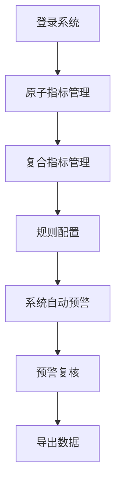

# 反洗钱监控系统 - 产品需求文档

## 1. Product Overview
反洗钱监控系统是一套金融合规风控工具，用于实时监控和分析可疑交易行为，提供指标管理和预警复核功能。
- 主要目的是帮助金融机构识别和防范洗钱、内幕交易、场外配资等风险行为，提升合规管理效率
- 目标用户为合规分析师和风控人员，市场价值在于自动化风控流程，降低人力成本

## 2. Core Features

### 2.1 User Roles
| Role | Registration Method | Core Permissions |
|------|---------------------|------------------|
| 合规分析师 | 企业内部账号 | 指标管理、预警复核、数据导出 |

### 2.2 Feature Module
1. **原子指标管理页**: 指标列表、查询筛选、新增编辑删除
2. **复合指标管理页**: 复合指标列表、逻辑公式配置、规则构建器
3. **预警复核页**: 预警记录、客户信息查看、详情展开

### 2.3 Page Details
| Page Name | Module Name | Feature description |
|-----------|-------------|---------------------|
| 原子指标管理页 | 查询筛选 | 按指标名称、场景类型、子类进行多条件筛选，支持重置查询条件 |
| 原子指标管理页 | 指标列表 | 表格展示指标ID、名称、场景类型、子类、描述、状态，支持分页（默认10条/页） |
| 原子指标管理页 | 新增编辑 | 弹窗表单，支持新增和编辑原子指标，包含指标名称、场景类型、子类、状态、描述字段 |
| 复合指标管理页 | 查询筛选 | 按指标名称、场景类型、状态筛选复合指标 |
| 复合指标管理页 | 复合指标列表 | 展示复合指标ID、名称、场景类型、逻辑公式、状态，支持分页 |
| 复合指标管理页 | 规则配置器 | 可视化规则构建器，支持添加原子指标、AND/OR逻辑运算符和括号分组，实时显示逻辑公式 |
| 预警复核页 | 查询筛选 | 按客户名称、客户号、场景类型查询预警 |
| 预警复核页 | 预警记录列表 | 展示预警日期、客户名称、客户号、部门、场景类型，支持分页 |
| 预警复核页 | 数据导出 | 支持导出预警记录数据 |

## 3. Core Process
用户登录系统后，可以先在指标管理模块配置原子指标和复合指标，设定监控规则。系统根据规则自动产生预警，合规分析师在预警复核页查看、分析和处理预警记录。

## 4. User Interface Design
### 4.1 Design Style
- **主色调**: 深蓝色系（品牌蓝 #3B82F6）作为主色，搭配中性色
- **按钮风格**: 圆角矩形，主按钮品牌蓝背景，次要按钮白色背景加边框
- **字体**: 无衬线字体，标题使用加粗，正文使用常规字重
- **布局风格**: 左侧固定侧边栏导航 + 右侧卡片式内容区域
- **图标风格**: 简洁的emoji图标（📊, 🔗, ⚠️, 👤）
- **组件风格**: 卡片式设计，带轻微阴影和圆角

### 4.2 Page Design Overview
| Page Name | Module Name | UI Elements |
|-----------|-------------|-------------|
| 原子指标管理页 | 侧边栏导航 | 深色背景，品牌蓝高亮当前页，分组显示功能模块 |
| 原子指标管理页 | 查询区域 | 白色卡片，表单四列布局，带查询和重置按钮 |
| 原子指标管理页 | 指标列表 | 表格形式，表头固定，行悬停效果，状态标签 |
| 复合指标管理页 | 规则配置弹窗 | 可视化规则构建器，显示逻辑公式，支持添加指标、运算符和分组 |
| 预警复核页 | 预警记录 | 表格展示，支持展开详情，场景类型标签 |

### 4.3 Responsiveness
- 桌面端优先设计（1440px+）
- 响应式适配，支持中等屏幕尺寸
- 表格支持横向滚动

### 4.4 交互反馈
- Toast提示框，顶部右侧滑入
- 按钮悬停效果
- 点击反馈
- 列表行展开/收起动画

---

## 5. 业务规则说明

### 5.1 场景类型
- 内幕交易
- 场外配资
- 非法集资
- 疑似贪腐

### 5.2 原子指标子类
- 客户特定身份
- 交易行为
- 盯市
- 出货

### 5.3 指标状态
- 生效
- 失效

### 5.4 复合指标逻辑规则
- 支持AND和OR逻辑运算符
- 支持括号分组
- 原子指标使用AXXX格式编号（如A001）

---

## 6. 数据模型

### 6.1 原子指标 (AtomicIndicator)
| 字段 | 类型 | 必填 | 说明 |
|------|------|------|------|
| id | string | 是 | 指标ID，数字递增 |
| name | string | 是 | 指标名称 |
| scenario | enum | 是 | 场景类型：内幕交易/场外配资/非法集资/疑似贪腐 |
| subCategory | enum | 是 | 子类：客户特定身份/交易行为/盯市/出货 |
| description | string | 否 | 指标描述 |
| status | enum | 是 | 状态：生效/失效 |

### 6.2 复合指标 (CompositeIndicator)
| 字段 | 类型 | 必填 | 说明 |
|------|------|------|------|
| id | string | 是 | 指标ID，格式CXXX（如C001） |
| name | string | 是 | 指标名称 |
| scenario | enum | 是 | 场景类型：内幕交易/场外配资/非法集资/疑似贪腐 |
| description | string | 否 | 指标描述 |
| formula | string | 是 | 逻辑公式（如A001 AND A004 OR A009） |
| rules | array | 是 | 规则配置数组，用于可视化构建 |
| status | enum | 是 | 状态：生效/失效 |

### 6.3 预警记录 (AlertRecord)
| 字段 | 类型 | 必填 | 说明 |
|------|------|------|------|
| id | string | 是 | 预警记录ID |
| alertDate | date | 是 | 预警日期 |
| customerName | string | 是 | 客户名称 |
| customerId | string | 是 | 客户号 |
| department | string | 是 | 部门 |
| scenario | enum | 是 | 场景类型：内幕交易/场外配资/非法集资/疑似贪腐 |
| compositeIndicator | string | 是 | 触发的复合指标名称 |
| details | array | 是 | 预警详情，包含命中的原子指标和实际值 |

