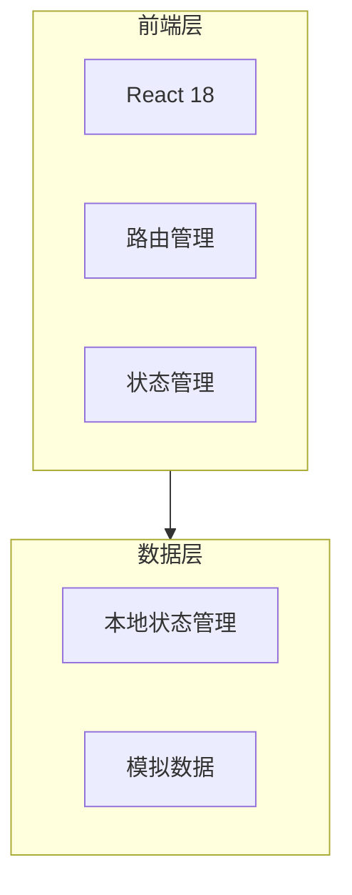

# 反洗钱监控系统 - 技术架构文档

## 1. Architecture Design



## 2. Technology Description

- **前端**: React@18 + TypeScript + Vite
- **样式方案**: Tailwind CSS v3
- **UI组件库**: 基于原型设计的自定义组件
- **构建工具**: Vite 5.x
- **初始化工具**: 使用 Vite 初始化项目

## 3. Route Definitions

| Route | Purpose |
|-------|---------|
| / | 重定向到原子指标管理页 |
| /indicators/atomic | 原子指标管理页 |
| /indicators/composite | 复合指标管理页 |
| /alerts | 预警复核页 |

## 4. Data Model and Type Definitions

```typescript
// 场景类型枚举
type ScenarioType = '内幕交易' | '场外配资' | '非法集资' | '疑似贪腐';

// 原子指标子类枚举
type SubCategoryType = '客户特定身份' | '交易行为' | '盯市' | '出货';

// 状态枚举
type StatusType = '生效' | '失效';

// 原子指标接口
interface AtomicIndicator {
  id: string;
  name: string;
  scenario: ScenarioType;
  subCategory: SubCategoryType;
  description: string;
  status: StatusType;
}

// 规则项类型
type RuleItemType = 'indicator' | 'and' | 'or' | 'group-start' | 'group-end';

interface RuleItem {
  type: RuleItemType;
  id?: string;
  name?: string;
}

// 复合指标接口
interface CompositeIndicator {
  id: string;
  name: string;
  scenario: ScenarioType;
  description: string;
  formula: string;
  rules: RuleItem[];
  status: StatusType;
}

// 预警详情项
interface AlertDetail {
  indicatorId: string;
  indicatorName: string;
  actualValue: string;
  threshold: string;
  isHit: boolean;
}

// 预警记录接口
interface AlertRecord {
  id: string;
  alertDate: string;
  customerName: string;
  customerId: string;
  department: string;
  scenario: ScenarioType;
  compositeIndicator: string;
  details: AlertDetail[];
}

// 分页参数
interface PaginationParams {
  page: number;
  pageSize: number;
}

// 查询参数 - 原子指标
interface AtomicQueryParams {
  name?: string;
  scenario?: ScenarioType | 'all';
  subCategory?: SubCategoryType | 'all';
}

// 查询参数 - 复合指标
interface CompositeQueryParams {
  name?: string;
  scenario?: ScenarioType | 'all';
  status?: StatusType | 'all';
}

// 查询参数 - 预警记录
interface AlertQueryParams {
  customerName?: string;
  customerId?: string;
  scenario?: ScenarioType | 'all';
}
```

## 5. Core Components Structure

```
src/
├── components/
│   ├── layout/
│   │   ├── Sidebar.tsx          # 侧边栏导航
│   │   └── MainHeader.tsx       # 主头部
│   ├── common/
│   │   ├── Card.tsx             # 卡片组件
│   │   ├── Table.tsx            # 表格组件
│   │   ├── Pagination.tsx       # 分页组件
│   │   ├── Modal.tsx            # 弹窗组件
│   │   ├── Button.tsx           # 按钮组件
│   │   ├── Input.tsx            # 输入框组件
│   │   ├── Select.tsx           # 下拉选择组件
│   │   ├── Tag.tsx              # 标签组件
│   │   └── Toast.tsx            # Toast提示
│   └── features/
│       ├── indicators/
│       │   ├── AtomicForm.tsx        # 原子指标表单
│       │   ├── RuleBuilder.tsx       # 规则构建器
│       │   └── FormulaDisplay.tsx    # 公式显示
│       └── alerts/
│           └── AlertDetail.tsx       # 预警详情展开
├── pages/
│   ├── AtomicIndicatorsPage.tsx  # 原子指标管理页
│   ├── CompositeIndicatorsPage.tsx # 复合指标管理页
│   └── AlertsPage.tsx            # 预警复核页
├── hooks/
│   ├── useAtomicIndicators.ts    # 原子指标业务逻辑
│   ├── useCompositeIndicators.ts # 复合指标业务逻辑
│   └── useAlerts.ts              # 预警记录业务逻辑
├── types/
│   └── index.ts                  # 类型定义
├── data/
│   └── mockData.ts               # 模拟数据
├── App.tsx
└── main.tsx
```

## 6. State Management Approach

- 使用 React Hooks + Context API 进行状态管理
- 各功能模块使用自定义 hooks 封装业务逻辑
- 本地状态管理查询条件、分页信息等
- 模拟数据初始化时从本地存储加载或使用默认数据

## 7. Key Business Logic

### 7.1 原子指标管理
- CRUD操作：增删改查
- 查询过滤：多条件组合筛选
- 分页显示

### 7.2 复合指标管理
- CRUD操作
- 规则构建器：可视化添加指标、逻辑运算符、分组
- 公式生成与解析
- 查询过滤与分页

### 7.3 预警复核
- 预警记录查询与过滤
- 详情展开查看
- 数据导出功能

## 8. Styling Approach

使用 Tailwind CSS 实现设计系统：

```javascript
// tailwind.config.js
export default {
  theme: {
    extend: {
      colors: {
        primary: {
          50: '#f8fafc',
          100: '#f1f5f9',
          200: '#e2e8f0',
          300: '#cbd5e1',
          400: '#94a3b8',
          500: '#64748b',
          600: '#475569',
          700: '#334155',
          800: '#1e293b',
          900: '#0f172a',
        },
        brand: {
          50: '#eff6ff',
          100: '#dbeafe',
          400: '#60a5fa',
          500: '#3b82f6',
          600: '#2563eb',
        },
        success: {
          100: '#dcfce7',
          500: '#22c55e',
        },
        warning: {
          100: '#fef3c7',
          500: '#f59e0b',
        },
        error: {
          100: '#fee2e2',
          500: '#ef4444',
        },
      },
      borderRadius: {
        sm: '4px',
        md: '6px',
        lg: '8px',
      },
    },
  },
}
```

## 9. Implementation Notes

1. **移动端适配**: 桌面端优先，可响应式适配平板设备
2. **性能优化**: 表格虚拟化、分页加载
3. **可访问性**: 语义化HTML、键盘导航支持
4. **数据持久化**: 初期使用 localStorage，后期可接入 Supabase
